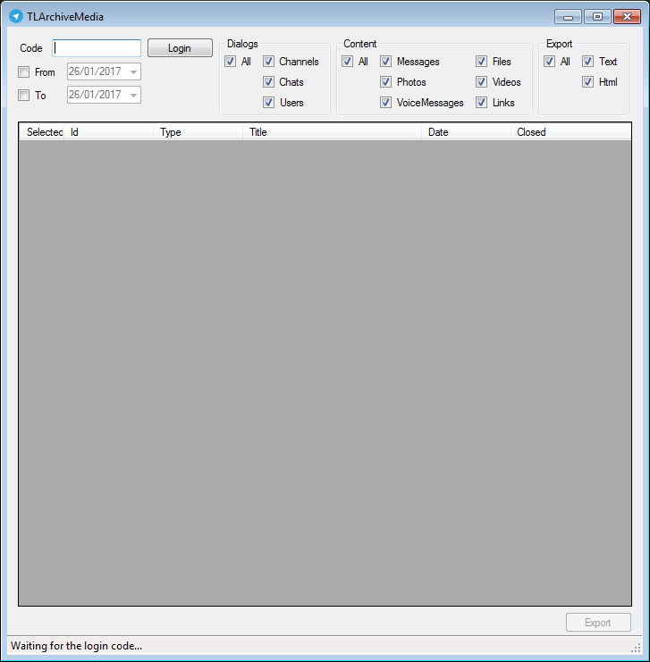

# TLArchiver

Archiver dialogs and messages of Telegram (http://telegram.org)

This project is based on TLSharp (https://github.com/sochix/TLSharp)

### Configuration

Create the configuration file `App.config` from the template [App.config.tpl](https://github.com/Starli0n/TLArchiver/blob/master/TLArchiver/App.config.tpl)

The proxy settings are defined by the parameters:
* `HttpProxyHost` (192.168.x.x)
* `HttpProxyPort` (80)
* `ProxyUserName` (username)
* `ProxyPassword` (password)

To obtain your own API id, follow the guidelines of [Telegram](https://core.telegram.org/api/obtaining_api_id)
* `ApiHash`
* `ApiId`
* `SignInPhoneNumberCode` (`+33` for France)
* `SignInPhoneNumber` (`06xxxxxxxx`)
Therefore, the number used for the connection would be `+336xxxxxxxx` = `SignInPhoneNumberCode` + `SignInPhoneNumber` without the first `0`.

Enter the code you receive by phone into the GUI and then click on `Login`.
Therefore let `CodeToAuthenticate` empty.

Set the output directory for the export `ExportDirectory`.
In `Debug`, this parameter is bypassed by the debug configuration [App.Debug.config](https://github.com/Starli0n/TLArchiver/blob/master/TLArchiver/App.Debug.config)

Set the limit of messages while requesting the server.
Messages of a dialog are read by packet of `MessagesReadLimit`.

If you want the app to count the messages of all dialogs during the initialisation step, set `CountMessagesAtLaunch` to true.
However, it will slow down the start.

The configuration is mainly based on the one defined by the [TLSharp](https://github.com/sochix/TLSharp/blob/master/TLSharp.Tests/app.config) library.
Some parameters are not used in the project, so let them empty:
* `NotRegisteredNumberToSignUp`
* `NumberToSendMessage`
* `UserNameToSendMessage`
* `NumberToGetUserFull`
* `NumberToAddToChat`

Note: `NumberToSendMessage` and `UserNameToSendMessage` are used whenever you want to send message with `TLSharp`.
